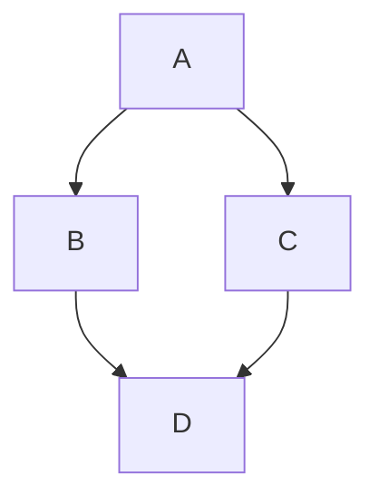

# Github_ProjectMOOD
An open source project for community contributions

<!-- 
Git branch:
  Xtools          -> prime version
  devTest1_Xtools -> html css
  devTest2_Xtools -> c#
  main            -> default template 
-->
<link rel="stylesheet" href="./.dev/Global/assets/styleMain.css">

<h1>Tài liệu học</h1>

Xin chào

<table class="custom-table">
    <thead>
        <tr>
            <th>Danh mục</th>
            <th>Mã màu</th>
            <th>Trạng thái</th>
        </tr>
    </thead>
    <tbody>
        <tr>
            <td>Giao diện tối</td>
            <td><code>#1E2229</code></td>
            <td>Hoàn thành</td>
        </tr>
        <tr>
            <td>Chữ hiển thị</td>
            <td><code>#E0E0E0</code></td>
            <td>Đang bật</td>
        </tr>
        <tr>
            <td>Thanh điều hướng</td>
            <td><code>#121212</code></td>
            <td>Chờ duyệt</td>
        </tr>
    </tbody>
</table>

